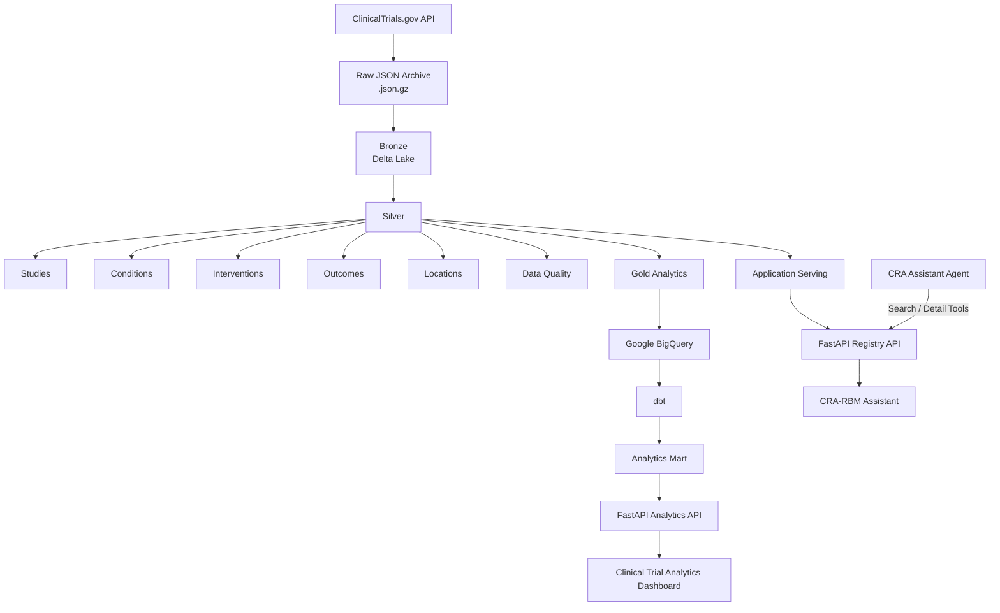

# Clinical Trials Data Platform

ClinicalTrials.gov 공개 registry 데이터를 대상으로 구축한 **Cloud Data Engineering 프로젝트**입니다.

ClinicalTrials.gov API의 nested JSON 데이터를 수집해 Databricks / Apache Spark / Delta Lake 기반으로 변환·품질관리하고, 분석용 데이터는 BigQuery와 dbt로 제공하며, 애플리케이션용 Study Search / Detail 데이터는 별도의 Serving Layer로 제공합니다.

이 프로젝트의 핵심 목표는 단순한 데이터 적재가 아니라 다음 흐름을 end-to-end로 구현하는 것입니다.

```text
Public Registry
    ↓
Cloud Data Pipeline
    ↓
Data Quality / Incremental Processing
    ↓
Analytics + Application Serving
    ↓
Dashboard / CRA-RBM / AI Agent
```

> Portfolio / learning project built with public ClinicalTrials.gov data.  
> It is not a production clinical-trial system and does not contain real patient data.

---

## Architecture



### Main design boundaries

- **Bronze** preserves raw source structure.
- **Silver** normalizes nested entities into reusable analytical grains.
- **Quality** validates defined rules and stores run-level results.
- **Gold** provides analytical aggregates.
- **Serving** provides application-oriented study search/detail datasets.
- **BigQuery + dbt** manages warehouse-side analytics modeling.
- **FastAPI** is the service boundary for frontend and AI-agent consumers.

---

## Data Scale

Full baseline load 기준입니다.

| Dataset               |          Rows |
| --------------------- | ------------: |
| Bronze Studies        |       604,566 |
| Silver Studies        |       604,566 |
| Silver Conditions     |     1,087,211 |
| Silver Interventions  |     1,022,647 |
| Silver Outcomes       |     3,567,302 |
| Silver Locations      |     3,532,550 |
| **Silver Total**      | **9,814,276** |
| Gold Yearly Summary   |         2,306 |
| Gold Country Summary  |         4,712 |
| Gold Condition Trends |       378,261 |
| Serving Study Search  |       604,566 |
| Serving Study Detail  |       604,566 |

ClinicalTrials.gov 전체 공개 registry 약 **60.5만 건**을 baseline으로 수집하고, nested entities를 분리하여 약 **981만 rows 규모의 Silver datasets**으로 구조화했습니다.

---

## 1. Full Ingestion

ClinicalTrials.gov API를 pagination 방식으로 수집합니다.

- Page size: 1,000
- Full registry baseline: 604,566 studies
- Approximately 605 API pages
- Estimated raw JSON size: ~10.6 GB
- Estimated gzip archive size: ~2.0 GB
- Page-level checkpoint
- Retry / backoff
- Resumable full ingestion

Raw API response는 변환 전에 `.json.gz` 형태로 보관합니다.

```text
ClinicalTrials.gov
        ↓
page_000001.json.gz
page_000002.json.gz
...
        ↓
Bronze
```

Full load는 staging-first 방식으로 수행한 뒤 QC 확인 후 production Bronze를 재구축할 수 있도록 구성했습니다.

---

## 2. Bronze Layer

Bronze는 source JSON을 최대한 원본 구조 그대로 보존하는 Delta table입니다.

```text
clinical_trials.bronze_studies
```

주요 목적:

- source fidelity 유지
- schema 변경 대응
- downstream 재처리 가능성 확보
- raw / transformed data separation
- incremental run lineage 유지

Bronze에서는 nested study structure를 flatten하지 않고 보존합니다.

---

## 3. Silver Layer

ClinicalTrials.gov nested JSON을 분석과 재사용에 적합한 entity 단위로 정규화합니다.

```text
silver_studies
silver_conditions
silver_interventions
silver_outcomes
silver_locations
```

### Grain

```text
silver_studies
1 NCT ID = 1 row

silver_conditions
1 Study × 1 Condition = 1 row

silver_interventions
1 Study × 1 Intervention = 1 row

silver_outcomes
1 Study × 1 Outcome = 1 row

silver_locations
1 Study × 1 Location = 1 row
```

Study-level fields include information such as:

- title
- study type
- phase
- overall status
- enrollment
- study design
- start / completion / update dates
- brief summary
- masking / who masked
- eligibility criteria

Nested arrays are separated into child datasets so that analytical grain remains explicit.

---

## 4. Data Quality

Pipeline run마다 데이터 품질 검사를 수행하고 결과를 Delta table에 append합니다.

Current rules:

1. NCT ID not null
2. NCT ID unique
3. Enrollment non-negative
4. Completion date >= Start date
5. Condition → Study referential integrity
6. Intervention → Study referential integrity
7. Outcome → Study referential integrity
8. Location → Study referential integrity
9. Latitude valid range
10. Longitude valid range

Latest validated full-load run:

```text
10 rules
failed rows: 0
failure rate: 0
```

`0 violations`는 **현재 정의된 10개 규칙에서 위반이 발견되지 않았다는 의미**이며, source data 자체가 완전하거나 오류가 없다는 의미는 아닙니다.

Quality results are stored with run-level metadata so that validation history can be reviewed over time.

---

## 5. Incremental Ingestion

Full baseline 이후에는 ClinicalTrials.gov `LastUpdatePostDate`를 기준으로 incremental ingestion을 수행합니다.

```text
Watermark
    ↓
ClinicalTrials.gov incremental query
    ↓
Raw incremental archive
    ↓
Schema alignment
    ↓
Source validation
    ↓
Hash-based change detection
    ↓
Delta MERGE by NCT ID
    ↓
Watermark update
```

Implemented features:

- watermark-based incremental ingestion
- same-watermark-date overlap to reduce missed same-day updates
- run-date / run-id based raw path isolation
- NCT ID based UPSERT
- source duplicate validation
- SHA-256 content hash comparison
- matched-row update only when content changed
- idempotent reprocessing
- watermark update only after successful MERGE

동일 batch를 다시 실행했을 때:

```text
new rows added: 0
matched rows updated: 0
```

이 되도록 구성하여 idempotency를 확인했습니다.

---

## 6. Gold Analytics

분석과 Dashboard 사용을 위한 aggregate datasets입니다.

```text
gold_yearly_summary
gold_country_summary
gold_condition_trends
```

Gold는 analytical grain을 명확히 유지합니다.

예를 들어 country summary에서는 Study-level enrollment를 country별로 단순 합산하지 않습니다. 하나의 Study가 여러 국가에 위치할 수 있어 enrollment grain과 country grain이 일치하지 않기 때문입니다.

Gold datasets are exported to Google BigQuery.

### BigQuery reconciliation

Export 이후 Databricks source와 BigQuery target row count를 비교합니다.

| Dataset          | Databricks | BigQuery |
| ---------------- | ---------: | -------: |
| Yearly Summary   |      2,306 |    2,306 |
| Country Summary  |      4,712 |    4,712 |
| Condition Trends |    378,261 |  378,261 |

---

## 7. dbt Analytics Modeling

BigQuery Gold datasets를 dbt source로 정의하고 warehouse-side analytics modeling을 구성했습니다.

```text
Databricks Gold
    ↓
BigQuery
    ↓
dbt Source
    ↓
Staging
    ↓
Analytics Mart
```

Current dbt scope includes:

- BigQuery Gold source definitions
- staging models
- `ref()` based dependency management
- analytics mart
- generic tests
- custom reconciliation test

Example mart:

```text
clinical_trials_dbt.mart_trial_overview
```

The application overview API consumes the dbt analytics mart rather than embedding all aggregation logic directly in application code.

dbt is intentionally used as a focused warehouse-modeling layer; Spark / Delta remains responsible for the main ingestion and transformation pipeline.

---

## 8. Application Serving Layer

Analytics용 Gold와 application 조회용 Serving datasets을 분리했습니다.

```text
serving_study_search
serving_study_detail
```

### `serving_study_search`

Search access pattern에 맞춰 Study 단위로 denormalized된 dataset입니다.

Includes fields such as:

- NCT ID
- brief / official title
- study type
- phases
- overall status
- enrollment
- start / completion date
- last update date
- conditions array
- countries array
- intervention names array
- results availability

Search results can be ordered by `last_update_date` so recently updated registry records are surfaced first.

### `serving_study_detail`

Detailed application view를 위한 Study-level nested dataset입니다.

Includes:

- study metadata
- brief summary
- eligibility criteria
- masking / who masked
- conditions
- interventions
- outcomes
- locations

Silver에서는 1:N entity를 별도 rows로 관리하고, Serving에서는 application 조회 편의를 위해 필요한 child entities를 Study 단위 arrays / structs로 다시 구성합니다.

---

## 9. Databricks Workflow

Recurring workflow:

```text
incremental-ingestion
        ↓
silver-core
        ↓
silver-nested
        ↓
data-quality
        ↓
gold-analytics
       /       \
      ▼         ▼
serving-layer  bigquery-export
```

Full ingestion은 recurring workflow와 분리되어 있으며, 초기 baseline 구축 또는 전체 재구축 시 사용합니다.

---

## 10. CRA-RBM Application Integration

Serving Layer는 별도 CRA-RBM Assistant 애플리케이션에서 실제로 소비됩니다.

```text
serving_study_search
        ↓
FastAPI Registry API
        ↓
Study Search / Import UI

serving_study_detail
        ↓
FastAPI Registry API
        ↓
Study Preview / Import
```

Current registry APIs:

```text
GET /api/registry/studies
GET /api/registry/studies/{nct_id}
```

The existing study-import frontend contract is preserved through a compatibility API layer while the underlying data source is now Databricks Serving.

Imported public registry studies can be converted into the CRA-RBM internal Study model and stored in Supabase.

---

## 11. Clinical Trial Analytics Application

Analytics path:

```text
Databricks Gold
    ↓
BigQuery
    ↓
dbt
    ↓
Analytics Mart
    ↓
FastAPI
    ↓
Next.js Dashboard
```

Current analytics APIs:

```text
GET /api/analytics/overview
GET /api/analytics/yearly
GET /api/analytics/countries
GET /api/analytics/conditions
```

Dashboard provides:

- trial overview
- study-type distribution
- trials by start year
- trials by country
- condition trend analysis

---

## 12. CRA Assistant Agent Integration

The CRA Assistant Agent consumes the same FastAPI Registry API instead of connecting directly to Databricks.

Current tools:

```text
searchRegistryStudies
getRegistryStudyDetail
```

Architecture:

```text
User
    ↓
CRA Assistant Agent
    ↓
Registry Tool
    ↓
FastAPI
    ↓
Databricks Serving
```

This keeps FastAPI as the service boundary and prevents the agent from depending on Databricks table structure directly.

Registry factual data is also kept separate from synthetic CRA-RBM operational data.

---

## Tech Stack

### Data Engineering

- Databricks
- Apache Spark
- PySpark
- Delta Lake
- Databricks Workflows / Lakeflow Jobs
- Databricks SQL

### Data Warehouse / Transformation

- Google BigQuery
- dbt

### Application Integration

- FastAPI
- Databricks SQL Connector
- Next.js
- TypeScript
- React Query
- Recharts

### External Consumer

- CRA-RBM Assistant
- CRA Assistant Agent

### Source

- ClinicalTrials.gov public registry

---

## Repository Structure

```text
.
├── notebooks/
│   ├── 01_bronze_ingestion
│   ├── 02_silver_transformation
│   ├── 03_silver_nested_entities
│   ├── 04_data_quality
│   ├── 05_gold_analytics
│   ├── 06_paginated_ingestion
│   ├── 07_incremental_merge
│   ├── 08_watermark_control
│   ├── 09_bigquery_export
│   ├── 10_serving_layer
│   └── 11_full_load
│
├── dbt/
│   └── clinical_trials_analytics/
│
├── docs/
└── README.md
```

---

## Key Engineering Decisions

### Separate Gold and Serving

Gold is optimized for analytics, while Serving is optimized for application access.

```text
Gold
→ aggregation / trends / dashboard analytics

Serving
→ search / detail / application API
```

This avoids forcing analytical datasets to also act as application read models.

### Preserve raw source before transformation

Raw API responses are archived before normalization so that downstream transformations can be rebuilt without re-fetching the entire registry.

### Explicit data grain

Each Silver dataset has a defined grain to avoid accidental duplication during joins and aggregation.

### Watermark + hash-aware MERGE

Watermark filtering limits incremental ingestion scope, while content hashing avoids unnecessary updates to unchanged records.

### Service boundary through FastAPI

Frontend and AI-agent consumers do not access Databricks directly.

This reduces coupling between application code and physical data-platform tables.

---

## Validation Status

The current implementation has been validated through:

- full registry baseline ingestion
- Silver entity row-count checks
- 10-rule data quality run
- incremental MERGE idempotency test
- recurring workflow execution
- Databricks → BigQuery row-count reconciliation
- dbt tests
- FastAPI analytics integration
- FastAPI registry search / detail integration
- CRA-RBM study import flow
- CRA Assistant Agent registry tool calls

---

## Limitations

This project is a portfolio / learning project and intentionally has several limitations.

- ClinicalTrials.gov is treated as a public registry source, not as a production SLA-backed feed.
- Data quality rules cover selected structural and consistency checks only.
- Full source-semantic validation is outside the current scope.
- The project uses batch / incremental processing rather than streaming.
- Databricks SQL Warehouse startup / query latency can affect application response time.
- Application serving is designed for portfolio-scale usage rather than a high-throughput production workload.
- Authentication, infrastructure governance, and secret management are simplified compared with an enterprise production platform.
- No real patient data or confidential clinical trial data is used.

---

## Documentation

Planned / maintained documentation:

```text
docs/
├── architecture.md
└── images/
```

`architecture.md` is intended to document the reasoning behind:

- full vs incremental ingestion
- Bronze / Silver / Gold / Serving boundaries
- data grain
- watermark and idempotency
- data quality strategy
- BigQuery / dbt analytics path
- application serving path
- service boundaries
- trade-offs and limitations

---

## Remaining Documentation Tasks

- [ ] Final architecture documentation
- [ ] Add pipeline / workflow screenshots
- [ ] Add dbt lineage screenshot
- [ ] Add BigQuery / analytics screenshots
- [ ] Add CRA-RBM registry integration screenshots
- [ ] Add CRA Assistant Agent tool-call example

All major pipeline, analytics, serving, application, and agent integrations described above are currently implemented.

---

## Notes

Credentials, service-account keys, Databricks tokens, raw datasets, and environment files are not included in this repository.

Do not commit:

- `.env`
- service-account JSON
- Databricks access tokens
- raw ClinicalTrials.gov archive files
- dbt local profiles containing credentials
